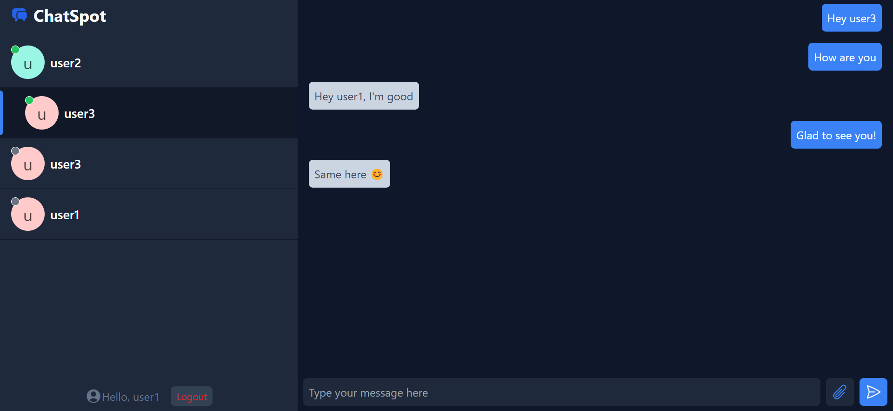

# ChatSpot

ChatSpot is a full-stack web application that allows users to chat in real time. It leverages ReactJs, WebSocket technology, Tailwind CSS, and MongoDB to provide a seamless and interactive messaging experience. Users can exchange text messages and media files, making communication dynamic and engaging.

## Features

- Real-time messaging using WebSocket technology
- MongoDB integration for storing and retrieving user messages
- Support for sharing media files
- User-friendly interface powered by ReactJs
- Responsive design and styling with Tailwind CSS

## Technologies Used

- **Frontend:** ReactJs
- **Styling:** Tailwind CSS
- **Backend:** Node.js, Express.js, WebSocket
- **Database:** MongoDB
